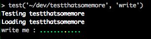

Extended Testing Framework for R [](https://travis-ci.org/robertzk/testthatsomemore) [](https://coveralls.io/r/robertzk/testthatsomemore?branch=master)
==========

Hadley's [testthat](https://github.com/hadley/testthat) revolutionized package development
in the R-sphere, but there are still some features lacking. `testthatsomemore` provides:

  * The ability to mock and stub functions and closures, including those in packages.
  * Creation of hierarchical file structures for testing of IO-related functions.
  * Pretending now is some other time, like Ruby's [Timecop gem](https://github.com/travisjeffery/timecop).
  * Indicating that some tests are pending.

To use, simply run `install.packages("testthatsomemore")` (for the latest
stable version 0.2.4, uploaded to CRAN on October 10, 2015), or the below
code to install the latest development version:

```r
if (!require(testthatsomemore)) {
  if (!require(devtools)) install.packages('devtools'); require(devtools)
  install_github('robertzk/testthatsomemore') 
}
```

Explicitly load `library(testthatsomemore)` before running unit tests with
`devtools::test`.

Examples
========

Stubbing
-------

To test certain functions in your package it may be required to "stub" away
some of the functionality to avoid unnecessary action. For example, when
testing a function that trains an algorithm over an extended period of time,
it would be helpful to skip the computationally expensive step and ensure
the rest of the code is working as expected. We can use testthatsomemore
in our tests as follows. Imagine we have a function as below.

```R
complicated_function <- function() {
  input <- something_simple()
  output <- something_long_and_complicated(input)
  something_else_simple(output)
}
```

We can then "stub" away the long and complicated sub-function so it
won't actually execute.

```R
context('your function')

test_that("it does what it's supposed to do", {
  stub(complicated_function, "something_long_and_complicated") <- function(...) "test"
  expect_identical(complicated_function(), something_else_simple("test"))
})
```

Mocking file structures
-----------

On other occasions, your R package may expect certain files to be present
on the file system. For example, imagine you are writing [a package](https://github.com/HenrikBengtsson/R.batch) that processes
batch jobs by moving files in a folder called "available" to a folder called "completed".
These jobs are represented in some simple text format. You could then test your
package as follows.

```R
test_that('it can perform a simple job', {
  within_file_structure(list(available = list(job1 = "some\nfile\ncontents")), {
    # `tempdir` is a special local variable that holds our directory
    # created on the fly for this test. When we get to the end of the test,
    # this directory will be deleted.
    perform_job(dir = tempdir, name = "job1")

    # expect_is_file is another testthatsomemore helper
    expect_is_file(file.path(tempdir, "completed", "job1"))
  })
})
```

Stubbing functions in packages
----------

Sometimes, it may be very difficult to stub away a certain method because you
do not own it (e.g., it is in another package). In this case, you can use
the `package_stub` function.

```R
test_that('it can stub away stats::lm!', {
  package_stub("stats", "lm", function(...) "I'm a model", {
    # Within the confines of these braces, lm is temporarily
    # a stubbed function. It will be restored when this test is over.
    expect_identical(lm(Sepal.Width ~ Sepal.Height, iris), "I'm a model")
  })
})
```

Pretend now is some other time
-------------

For some tests, we may want to temporarily stub the current timestamp to be
something else. For example, if we would like to test that our package can
store the last time it has given the user a helpful tip, and only re-show
that tip once every month, we could use the `pretend_now_is` helper function.

```R
expect_output(show_tip(), "helpful tip") # Or some message you wrote.
expect_output(show_tip(), "") # No output the second time! Too soon.
pretend_now_is("2 months from now", {
  # We can use English. Any combination of <number> <time>s <from now/ago>
  # will work, e.g., "5 seconds from now", "3 months ago", etc.
  expect_output(show_tip(), "helpful tip")
})
```

Mocking httr response
-------------

We want to be able to mock http GET and PUT response objects when testing. For this purpose, you can use mock_httr_response to create an httr object.

```R
describe("mocking httr GET", {
  with_mock(
    `httr::GET` = function(...) mock_httr_response(200L, list(data = "my data!"), "json"),
    test_that("my test", {
      ...
      ...
  })
})
```

Pending
-------

Keeping in line with test-driven development, we should be able to denote
that a test is "pending" completion. If you use testthat with the default
reporter (think lines of green dots), the `pending` function will display
a yellow dot to indicate it must still be implemented.

```R
test_that('i have to write this test', {
  pending()
})
```



```
               ^ pending
```                    
